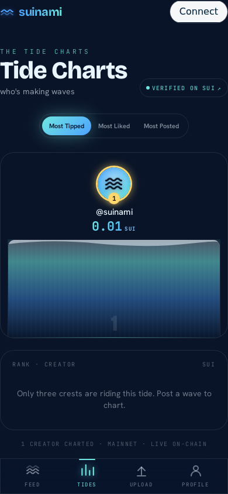
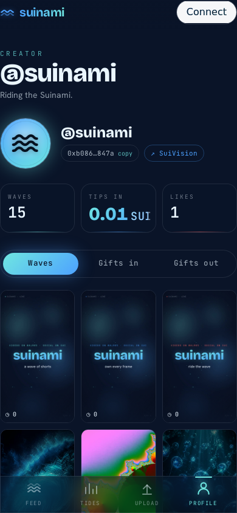

# Suinami 🌊

**Short-form video, fully on-chain social.** A vertical TikTok/Reels-style feed where the
video bytes live on **[Walrus](https://walrus.xyz)** decentralized storage, the social graph
(profiles, posts, likes, and real-SUI gifting) lives as **[Sui](https://sui.io) Move** objects,
and **every** Sui RPC — reads, writes, and the indexer's event polling — routes through the
**[Tatum](https://tatum.io)** gateway. No public fullnode is ever contacted.

The name is `Sui` (水, water) + `tsunami`.

> **Live on Sui mainnet.** The `suinami::feed` Move package is published, seeded, and serving
> real on-chain content through Tatum, with media on Walrus mainnet.
>
> | | |
> |---|---|
> | Network | `mainnet` |
> | Package ID | `0xc8cd42bb010547a96436db9680576a3d112fdbc39e5016def3a97b9bbfb77317` |
> | Shared `Feed` object | `0x3560a1ee825b2b61adbcbdacec489cfc9e96e18e057ba1ea24cac665b1690885` |
> | Sui RPC | `https://sui-mainnet.gateway.tatum.io` (auth via `x-api-key`) |
> | Walrus | `aggregator.walrus-mainnet.walrus.space` / `publisher.walrus-mainnet.walrus.space` |

### Try it

There's no hosted instance — run it locally (see [Getting started](#getting-started)). The
deployment is verifiable on-chain: open the package or any `GiftSent` transaction on
[SuiVision](https://suivision.xyz), or hit the live API — `/api/feed`, `/api/leaderboard`,
`/api/profile/<addr>`, `/api/gifts?address=<addr>`.

**Proof points** — two smoke tests verify the integrations against live infrastructure:

- **`pnpm smoke`** — a Sui read returns through the Tatum gateway with the `x-api-key` header.
- **`pnpm smoke:walrus`** — bytes store→read round-trip *byte-for-byte*, and the minted Walrus `Blob`
  object's owner (read back **through Tatum**) equals the creator — proving the `send_object_to`
  ownership hand-off actually moved the object on-chain.

---

## What makes this notable

- **Walrus is the storage layer, not a CDN stand-in.** Real publisher writes, erasure-coded
  slivers across storage nodes, aggregator reads — and an **on-chain ownership hand-off** so the
  *creator* owns the Sui `Blob` object for every video, poster, and avatar they upload (most
  integrations silently leave that object owned by the publisher).
- **A clean, content-addressed Walrus ↔ Sui bridge.** The only coupling between Walrus bytes and
  the Sui object graph is the content-addressed `blob_id` — carried on the `Video`/`Profile`
  objects *and* in their events, then resolved back to playable aggregator URLs by the indexer.
- **A real Tatum gateway-capability gap, solved.** Tatum doesn't proxy
  `suix_getLatestSuiSystemState` — which the Mysten SDK auto-calls during gas resolution, silently
  breaking the naive write path. The fix is a network-agnostic explicit-gas recipe, wired through a
  single client so the credential can't be bypassed.
- **It's a complete product, not a demo stub.** Four screens, a live mainnet deployment, an event
  indexer, optimistic-but-real on-chain writes (like / gift / post), a gift leaderboard, a creator
  upload→publish loop, and server-side hardening (upload validation + comment rate limiting).

---

## Screenshots

| Tide Charts (leaderboard) | Profile + on-chain gift ledger |
|:---:|:---:|
|  |  |

Both show the real Walrus avatar and live on-chain stats. The feed is a full-screen vertical video
pager, best seen live (`pnpm dev`).

---

## Architecture

A pnpm + Turborepo TypeScript monorepo.

```
apps/
  web/        @suinami/web    React 19 + Vite SPA — the 4-screen client, wallet connect, on-chain writes
  api/        @suinami/api    Hono server — REST endpoints + a boot-safe Sui event indexer → SQLite

packages/
  contracts/  @suinami/contracts   the suinami::feed Sui Move package + publish/seed/set-avatar tooling
  sui/        @suinami/sui         the single Tatum-gated getSuiClient() + PTB builders
  walrus/     @suinami/walrus      Walrus publisher/aggregator helpers (storeBlob, blobUrl)
  shared/     @suinami/shared      cross-cutting Zod schemas, types & constants (gift tiers, MIST<->SUI, ...)
  ui/         @suinami/ui          shared design tokens & presentational primitives
```

### Data flow (end-to-end)

```
 Creator                                   Sui mainnet (Move)     Tatum gateway      Indexer + API         React client
   |                                              |                     |                  |                     |
   | 1. upload bytes --> Walrus publisher         |                     |                  |                     |
   |                     (PUT, erasure-coded)     |                     |                  |                     |
   |                     <-- blob_id (hash)        |                     |                  |                     |
   |                                              |                     |                  |                     |
   | 2. post_video / like / send_gift -- wallet-signed ---------------->| broadcast        |                     |
   |                                Video object + VideoPosted event -->| (every RPC)      |                     |
   |                                              |                     |<-- poll 8s ------ |                     |
   |                                              |                     |  multiGetObjects  | SQLite rollups      |
   |                                              |                     |                  | /api/feed,profile,. |--> fetch (TanStack)
   |                                              |                     |                  |                     |
   | 3. stream media <----------------- Walrus aggregator (GET /v1/blobs/<blob_id>) --------------------------- |
```

Only **metadata** flows through the API. The video **bytes never do** — the client streams them
directly from the Walrus aggregator.

---

## Tatum

Every Sui JSON-RPC call Suinami makes — a wallet balance lookup, a gift broadcast, the indexer's
event polling — travels through Tatum's Sui gateway. Tatum is *the* Sui transport, funneled through
a single file (`packages/sui/src/client.ts`) so the credential and the rate-limit policy live in one
place and can't be bypassed or duplicated.

### One integration point, zero leakage

`getTatumTransport()` builds a `JsonRpcHTTPTransport` pointed at the Tatum gateway and injects the
auth header exactly once, on the transport itself:

```ts
rpc: { headers: { "x-api-key": cfg.apiKey } }
```

Because the header is attached at the transport layer, it rides along on *every* outbound request
the client ever makes — `queryEvents`, `multiGetObjects`, `getReferenceGasPrice`, `getCoins`,
`executeTransactionBlock` — with no per-call plumbing to forget. `getSuiClient()` memoizes per
config, so the API, the indexer, and every script share one warm, throttled client. The gateway
URLs are the single source of truth in `packages/shared/src/constants.ts` (`TATUM_RPC_URLS`, with
separate mainnet / testnet / devnet gateways).

### A throttle + 429-retry queue welded into the transport

Tatum's gateway caps at roughly **3 requests/second**. Rather than scatter retry logic across call
sites, the transport's `fetch` is replaced with a custom `tatumFetch` that wraps the real `fetch`
in two layers:

- **A process-wide serialized queue** chains every request behind a shared promise and enforces a
  `~360 ms` minimum interval (≈2.7 req/s, comfortably under the cap). So even when the indexer's
  multi-call tick overlaps a wallet write, requests are *spaced*, not bursted.
- **Linear-ramp 429 backoff** — on a `429` it sleeps `700 × (attempt + 1)` ms and retries up to 6
  times.

The win: this lives *inside* the transport's `fetch`, so every consumer — the React app's reads, the
long-running indexer, and the one-shot publish/seed scripts — inherits rate-limit safety for free,
and nobody hand-rolls retries.

### Every dapp-kit read routes through Tatum

On the client (`apps/web/src/providers.tsx`), `SuiClientProvider`'s `createClient` returns *our*
`getSuiClient(...)` instead of dapp-kit's default factory. The consequence is total: every read
dapp-kit performs — balances, owned objects, dry-runs, the connected wallet's own RPC reads — goes
through Tatum with the `x-api-key` header. As belt-and-suspenders, even the `networks` registry
handed to dapp-kit uses the Tatum URLs.

### The Tatum-safe write recipe (the real engineering win)

The subtle problem: **Tatum's Sui gateway does not proxy `suix_getLatestSuiSystemState`.** That
matters because the Mysten SDK calls exactly that method when it auto-resolves gas during
`tx.build()` — so the naive write path silently fails against Tatum. The fix, in
`apps/web/src/wallet/useOnChainWrite.ts`, is to resolve gas **explicitly** using only Tatum-supported
RPC, leaving `build()` with nothing to look up:

1. `getReferenceGasPrice()` + `getCoins()` (the largest-balance coin becomes the gas payment).
2. `setSender` / `setGasOwner` / `setGasPrice` / `setGasBudget` / `setGasPayment` are all set
   manually — this is precisely what avoids the unsupported `getLatestSuiSystemState` call.
3. The wallet signs the **exact bytes** produced by `tx.build({ client })` — building from these
   exact bytes is what makes the wallet prompt reliably open.
4. Broadcast goes through the Tatum client via a custom `execute` calling
   `client.executeTransactionBlock(...)`, so the *submit* — not just the reads — is provably through
   Tatum, returning parsed effects + object changes.

This recipe is network-agnostic: the identical code path works on testnet and mainnet because
nothing depends on a node-specific endpoint. The same discipline holds in the publish, seed, and
`set-avatar` scripts and in the server-side indexer.

---

## Walrus

Walrus is where every byte that matters in Suinami lives — the video bytes, the poster frames, and
the avatar images. This is the full integration, not a CDN stand-in: real publisher writes,
on-chain ownership hand-off to the creator, a content-addressed bridge into Sui Move objects, and
content-hash-driven media migration to mainnet with zero re-posting.

### The two-service client (`@suinami/walrus`)

Walrus splits read and write across two independent HTTP services, and the client models that
explicitly (each function takes its base URL, so publisher and aggregator can be different hosts):

- **Publisher (write).** `storeBlob()` does a raw `PUT ${publisherUrl}/v1/blobs?epochs=${epochs}`.
  Walrus erasure-codes the bytes, registers the blob on Sui, distributes slivers to storage nodes,
  and returns a **content-addressed `blobId`**. The client normalizes both publisher response
  shapes — `newlyCreated` (a freshly certified blob, with the minted Sui object id) and
  `alreadyCertified` (Walrus already held these exact bytes and reused them).
- **Aggregator (read).** `blobUrl(aggregatorUrl, blobId)` builds
  `${aggregatorUrl}/v1/blobs/${blobId}`, and a 404 (expired storage epochs) is surfaced as a
  friendly "blob washed away."

### The ownership hand-off — the creator owns their on-chain Blob object

By default the **publisher's** Sui account becomes the owner of the on-chain Walrus `Blob` object
minted during a PUT — meaning the blob would belong to whoever runs the infra, not the user.
`storeBlob` appends **`&send_object_to=<creatorAddress>`** to the PUT so the publisher transfers
that `Blob` Sui object to the **creator's** address. The creator — not the server — owns, and can
later delete or extend, their own media storage object.

This is proven on-chain, not asserted: `pnpm smoke:walrus` PUTs a unique blob with
`send_object_to=creator`, round-trips the bytes back from the aggregator and asserts **byte-for-byte
identity**, then reads the minted `Blob` object's owner **through the Tatum gateway** and asserts
`owner === creator`.

### The upload route — two blobs, validated before we pay to store

`POST /api/upload` stores **both** a video and its poster frame as two Walrus blobs, and hardens the
path *before* spending Walrus storage:

- a **`Content-Length` pre-check** → `413` before buffering a giant body into memory;
- **authoritative size gates** on the buffered Blob sizes (video > 100 MB → `413`, poster > 8 MB →
  `413`, empty → `400`);
- **magic-byte sniffing** that trusts the *bytes*, not the client-spoofable MIME (`ftyp`→mp4/mov,
  EBML→webm, `FFD8FF`→jpeg, `89504E47`→png, `RIFF…WEBP`) → anything else `415`.

Only then does it call `storeBlob` for video and poster **in parallel**, each with
`sendObjectTo: creator`, and return the two `blobId`s. The client carries them into a Sui
transaction.

### The Walrus ↔ Sui bridge — blob ids as the only coupling

The entire link between Walrus storage and the Sui object graph is **two `String` fields**:

- **Move side** (`feed.move`): the `Video` object stores `blob_id` (the video bytes) and
  `poster_blob` (the still) and holds *no bytes itself*. `post_video` writes these into the object
  **and emits them in the `VideoPosted` event**, so the indexer can build a playable card without
  re-reading the object. `Profile.avatar_blob` works the same way.
- **Builder side** (`packages/sui/src/tx.ts`): `buildPostVideoTx` persists `blobId` + `posterBlob`
  as Move `string` arguments — the join key written on-chain.
- **Resolution side** (indexer + feed): the indexer copies the blob ids verbatim from the
  `VideoPosted` event, then `GET /api/feed` turns each on-chain `blob_id` back into a **playable
  aggregator URL** via `blobUrl(...)` for video, poster, and avatar. An on-chain string in, a
  streamable Walrus URL out.

### Content-addressing, leveraged operationally

Walrus `blobId`s are **content hashes** — the id is a function of the bytes, not of when or where
you stored them. When migrating media from Walrus testnet to **mainnet**, we re-stored the *same
bytes* (`walrus store *-video.mp4 *-poster.jpg --epochs 30`). Because the bytes were identical,
**mainnet produced the exact same `blob_id`s the on-chain `Video` objects already referenced** — so
there was **no re-post, no dedup pass, and no DB reset**: store the bytes, flip the aggregator URL.
The same property shows up in code as `storeBlob`'s `alreadyCertified` fast path. When media
genuinely *changes*, the new bytes yield a new blob id and we re-post a fresh `Video` with the same
caption; the feed and profile routes **dedup by caption, newest-first**, so the clean re-post
supersedes the old immutable `Video` without deleting anything on-chain.

### Avatars on Walrus too

Avatars are real Walrus blobs end-to-end, not gradient placeholders: a 512×512 image is
`walrus store`d, then set on-chain via `update_profile(profile, display_name, avatar_blob, bio)`
(preserving the other fields). Because `ProfileCreated` carries only the handle, the indexer
`multiGetObjects` the `Profile` objects each tick to read `avatar_blob` / `bio` / `display_name`
(overwriting only on a non-empty read, so a transient RPC miss can't wipe an avatar). All three read
routes — `/api/feed`, `/api/profile`, `/api/leaderboard` — project the avatar through the
aggregator.

---

## Sui — on-chain social graph & gifting

The social and economic layer lives entirely on Sui. The Move package `suinami::feed` is the source
of truth for **who posted what**, **likes**, **views**, and **real-SUI tips**. Video bytes are never
on-chain — the only link to Walrus is the content-addressed `blob_id` / `poster_blob` strings on the
`Video` object.

### The Move module (`packages/contracts/sources/feed.move`)

**Objects**

- `Profile` (shared) — `owner`, `handle`, `display_name`, `avatar_blob` (Walrus id), `bio`, plus
  running `video_count`, `total_tips_received`, `total_likes_received`.
- `Video` (shared) — `creator`, `blob_id` + `poster_blob` (the Walrus↔Sui bridge), `caption`,
  `duration_ms`, `width`, `height`, and on-chain `like_count`, `view_count`, `tip_total`. Holds no
  bytes.
- `Feed` (shared singleton) — a global `video_count` discovery anchor, created and shared in `init`.
- `Like` (`key`) — a proof-of-like receipt transferred to the fan; burning it (unlike) decrements
  the counter.
- `GiftReceipt` (`key, store`) — minted to the tipper with `amount_mist`, `tier`, `sent_at_ms`.

**Events** emitted by the module: `VideoPosted` (carries the Walrus pointers), `VideoLiked`,
`VideoUnliked`, `VideoViewed`, `ProfileCreated`, and `GiftSent` (carries both running tip totals).
The indexer polls only `VideoPosted`, `ProfileCreated`, and `GiftSent` — like/view counts are read
straight from the `Video` objects (via `multiGetObjects`), not from the Liked/Viewed events.

**Entry functions**: `create_profile`, `update_profile` (owner-only), `post_video`, `like_video`
(no `Clock`), `unlike_video` (asserts the `Like` matches), `record_view` (permissionless, no
signer), and `send_gift` — which asserts `amount ≥ tier floor`, `public_transfer`s the full coin to
the creator, bumps the on-chain tip totals, mints a `GiftReceipt`, and emits `GiftSent`. The module
ships Move unit tests covering post/like/unlike/view, create+gift, and a below-floor abort.

**Gift tiers** (MIST floors asserted on-chain; mirrored in `@suinami/shared`):

| Tier | Name | Floor (MIST) | Floor (SUI) |
|---|---|---|---|
| 0 | Ripple | `10_000_000` | 0.01 |
| 1 | Splash | `100_000_000` | 0.1 |
| 2 | Wave | `500_000_000` | 0.5 |
| 3 | Tsunami | `1_000_000_000` | 1.0 |

The tier id is otherwise cosmetic (it drives the splash→tsunami UI animation); a fan may always send
more than the floor.

### The on-chain write path

1. **Upload to Walrus first** — the media bytes become a `blob_id` (+ poster `blob_id`); nothing is
   on Sui yet.
2. **Build an unsigned PTB** — `packages/sui/src/tx.ts` turns the action into a `Transaction`
   targeting `<pkg>::feed::<fn>`. `buildPostVideoTx` writes the Walrus blob ids as on-chain
   `string`s; `buildGiftTx` splits the tip off the gas coin into a fresh `Coin<SUI>`.
3. **Gate on a wallet** — `ConnectGate.requireWallet(action)` opens the wallet picker if needed.
4. **Tatum-safe gas, sign, broadcast** — `useOnChainWrite.runTx` resolves gas explicitly (avoiding
   `getLatestSuiSystemState`), the wallet signs the exact built bytes, and the block is broadcast via
   the Tatum client (see [Tatum](#tatum)).
5. **The chain emits an event** and updates the shared object's counters/balances.
6. **The indexer projects it** — within ~8 s the poll reads the event, hydrates authoritative
   counts/identity via `multiGetObjects`, and upserts the SQLite rollups the read APIs serve.

### The indexer (`apps/api/src/indexer.ts`)

An **8-second poll** projects on-chain events into SQLite rollups (`videos`, `gift_events`,
`creator_stats`) via Drizzle. It's **boot-safe**: if the package isn't configured it stays dormant
with *zero* network calls. Each tick re-reads the 50 newest of each polled event type
(`ProfileCreated`, `VideoPosted`, `GiftSent`); idempotent upserts keep it correct without cursor
bookkeeping. Per tick it hydrates `Profile` identity (avatar/bio) and `Video` counts via
`multiGetObjects`, folds `GiftSent` amounts into lifetime tips exactly once (keyed by
`txDigest:eventSeq`), and rolls per-creator video/like counts deduped by caption.

### Read APIs (`apps/api/src/routes`)

- `GET /api/feed` — newest-first page; resolves blob ids to playable aggregator URLs; caption-dedup.
- `GET /api/profile/:address` — a creator's profile + their videos as cards.
- `GET /api/leaderboard` — four boards (tips / rising / likes / videos); each row carries a
  SuiVision `verifyUrl`.
- `GET /api/gifts` — a creator's gift ledger (received / sent); each entry exposes the tx digest for
  a SuiVision `/txblock` link.
- `/api/comments/:videoId` — the **only off-chain write path**; Zod-validated, sanitized
  (control/zero-width/BiDi stripped), IP rate-limited (8 / 10 s), parameterized via Drizzle, JSON-only
  (no XSS).

---

## Features

| Screen | What it does |
|---|---|
| **Feed** | A scroll-snap vertical video pager (one card per viewport) playing real Walrus video. Single `IntersectionObserver` autoplay, global mute, optimistic likes + gifting that fire **real wallet-signed on-chain txs** (revert on failure), comment sheet, pull-to-refresh, and full keyboard nav (↑/↓ page, Space, L, C, R, M). Branded skeleton → empty/upload-invite → live feed → graceful `SAMPLE_FEED` fallback. |
| **Tide Charts** | A leaderboard styled as an oceanographic instrument. Three boards from `/api/leaderboard`; the top 3 render as rising-water "crest" columns. Every metric is verifiable on SuiVision; rows open the creator's profile. |
| **Upload** | Wallet-gated "post a wave": pick → preview (first frame painted to a `<canvas>` poster) → caption → release. Stores video + poster on Walrus, then `post_video` (wallet-signed, via Tatum) mints the `Video` object. Stored blobs survive a failed on-chain post, so the chain step retries without re-upload. |
| **Profile** | A creator's on-chain harbour: count-up stat trio (waves / tips-in SUI / likes), a Walrus-poster waves grid (tap to deep-link into the feed), and a **gift ledger** ("Gifts in / Gifts out") from `/api/gifts` — real `GiftSent` events, each linking to SuiVision. |

The app is hardened with a screen-level `ErrorBoundary`, a global unhandled-rejection → toast
handler, accessible names on every control, and `prefers-reduced-motion` support throughout.

---

## Tech stack

- **Web** — React 19.2, **Vite 6.4** (`@vitejs/plugin-react` 5), Tailwind CSS v4, **@mysten/dapp-kit**
  1.0 + **@mysten/sui** 2.17 (wallet connect + signing), **@tanstack/react-query** 5, **motion** 12,
  `vite-plugin-pwa`.
- **API** — **Hono** 4 on `@hono/node-server`, **better-sqlite3** + **Drizzle ORM**, **zod** 4.
- **Tooling** — TypeScript 5.9 (strict), Turbo 2.9, `tsx`, pnpm 9.

> **Why Vite 6?** The minimum supported runtime is **Node 22.11** (`engines: >=22.11.0`) and Vite 7
> requires Node `20.19+ / 22.12+`. On 22.11 (just below 22.12) the project stays on Vite 6; bumping
> Node unlocks Vite 7/8.

---

## Getting started

```bash
cp .env.example .env          # fill TATUM_API_KEY, Walrus URLs, SUI_NETWORK, etc.
pnpm i                        # install (Node >= 22.11, pnpm >= 9)

# On-chain setup (testnet)
pnpm setup:deployer                          # generate + faucet-fund a deployer key
pnpm --filter @suinami/contracts run publish # publish the Move package -> paste IDs into .env
pnpm --filter @suinami/contracts run seed    # seed demo on-chain content

pnpm dev                      # turbo: web (Vite :5173) + api (:8787)
```

> **Mainnet path:** set `SUI_NETWORK=mainnet` + the mainnet Tatum/Walrus URLs in `.env`, run
> `pnpm setup:mainnet`, then `pnpm --filter @suinami/contracts run publish` / `run seed` (the scripts
> auto-select the mainnet deployer key). `pnpm smoke` and `pnpm smoke:walrus` run against whatever
> `SUI_NETWORK` is in `.env`, so the mainnet proofs are reproducible directly.

The API is **boot-safe**: it starts with an empty `SUINAMI_PACKAGE_ID` and makes **zero** network
calls until the package is configured, so `pnpm dev` works before publishing.

Useful scripts:

```bash
pnpm smoke          # Sui client smoke test (proves reads route through Tatum + x-api-key)
pnpm smoke:walrus   # Walrus store->read round-trip + send_object_to ownership check via Tatum
pnpm typecheck      # tsc across the workspace (strict)
pnpm build          # build web (vite) + type-check the packages
```

### Configuration

All config is environment-driven (see `.env.example`). `.env` is gitignored; **never commit real
keys.**

The Tatum key is mirrored to the browser as `VITE_TATUM_API_KEY` so the client's own Sui reads also
ride the gateway. This is a deliberate, disclosed trade-off — a **read-scoped, rate-limited** gateway
key exposed for the demo so the dApp can read Sui directly. The documented production path is an
**API read-proxy** (the browser calls our API for reads, keeping the key server-side), which the
single-chokepoint `getSuiClient` design makes a one-file change.

---

## Project status

Production-ready for the Tatum × Walrus hackathon: published and seeded on **Sui mainnet**, media on
**Walrus mainnet**, every Sui RPC through **Tatum**. The full workspace `typecheck` passes and the
web app builds clean. A CDP audit across the four screens found **zero console errors** and an
accessible name on every interactive control — alongside alt text on every image, a screen-level
`ErrorBoundary`, a global unhandled-rejection handler, and `prefers-reduced-motion` support
throughout.
