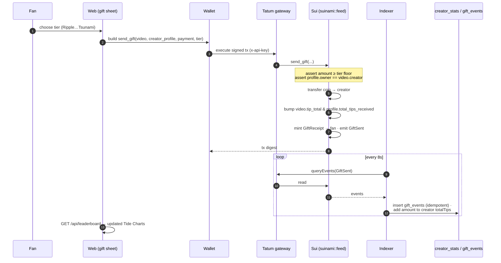
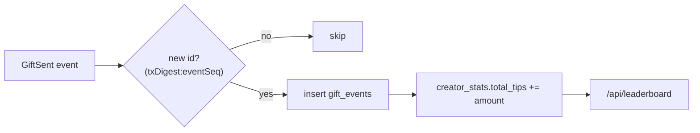

# Gifting SUI

Gifting is **real value transfer**: a fan sends actual SUI to a creator, settled on Sui
mainnet, with a receipt minted to the fan's wallet. There is no platform token and no escrow
— the coin moves directly from fan to creator inside one Move call.

## Sequence

## What `send_gift` guarantees

The Move entry function enforces the rules on chain, so the client can't cheat them:

- **Floor price.** `payment` must be `≥` the selected tier's floor (`EInsufficientGift`
  otherwise). Tiers are cosmetic above the floor — a fan may always send more.
- **Creator match.** The supplied `creator_profile` must belong to the video's creator
  (`EProfileVideoMismatch`), keeping the per‑creator tip rollup honest.
- **Direct payment.** The **full** coin is `public_transfer`‑ed to the creator. Running totals
  on both the `Video` (`tip_total`) and the `Profile` (`total_tips_received`) are incremented.
- **Receipt.** A `GiftReceipt` object (with `store`, so wallets can display it) is minted to
  the fan, and a `GiftSent` event carrying both running totals is emitted for the indexer.

See the [gift tiers](../sui/gifts.md) for the exact floor prices, and
[Move functions](../sui/functions.md#send_gift) for the full signature.

## How the leaderboard stays correct

The indexer inserts each `GiftSent` into `gift_events` keyed by `txDigest:eventSeq` with
`onConflictDoNothing` — so re‑reading the 50 newest events every tick never double‑counts.
Only when a gift row is genuinely new does the indexer fold its amount into
`creator_stats.total_tips`. The **Tide Charts** leaderboard then ranks creators straight from
that rollup. → [The indexer](indexer.md)

