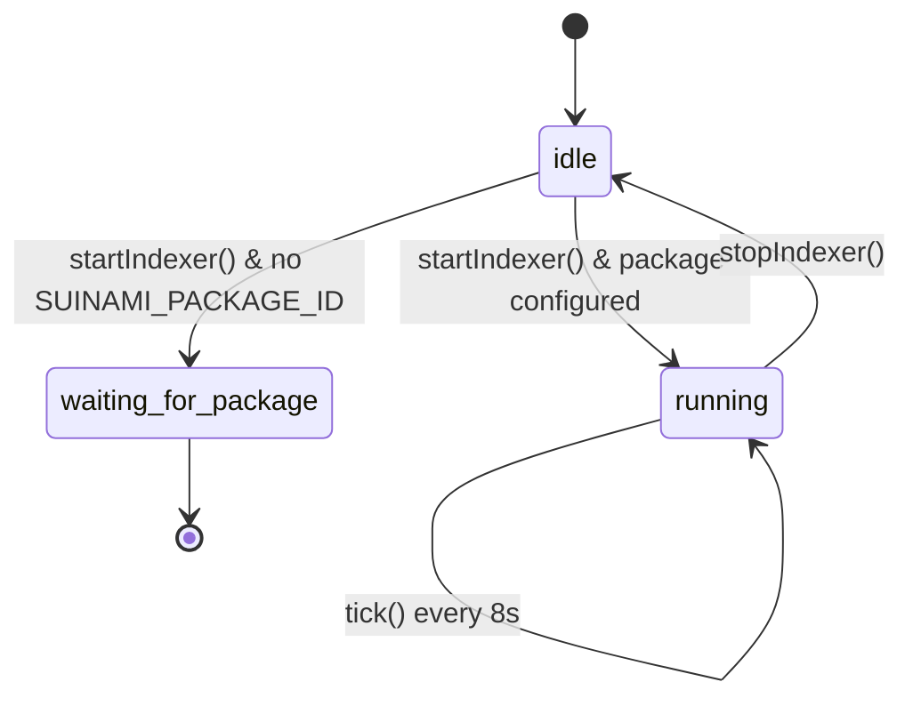
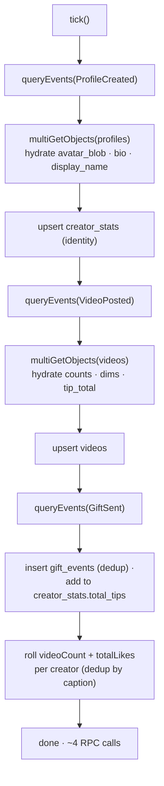

# The indexer

The indexer is the bridge from **on‑chain events** to a **fast local read model**. It lives
in `apps/api/src/indexer.ts`, polls Sui through Tatum every 8 seconds, and projects events
into SQLite rollups that the `/api/*` routes serve.

## Boot-safety contract

If the Move package isn't configured (`SUINAMI_PACKAGE_ID` unset), `startIndexer()` logs a
notice and returns immediately — **no interval is scheduled and no RPC client is built**, so
the API process makes zero network calls at startup. This is what lets the server boot cleanly
before (or without) a published package; `/health` reports `waiting-for-package`.

## One tick

Each tick re‑reads the 50 newest events of each type and performs **idempotent** upserts, so
correctness never depends on cursor bookkeeping (a deliberate scale‑deferral for the
hackathon). A `polling` guard prevents overlapping ticks.

Every `queryEvents` / `multiGetObjects` call goes through `getSuiClient(...)`, which attaches
the Tatum `x-api-key` header. Each tick is ~4 RPC calls; the shared transport throttles to
under 3 req/s, so a tick takes ~1.5 s — comfortably inside the 8 s interval. → [Tatum](../tatum.md)

## The rollup tables

| Table | Built from | Serves |
|---|---|---|
| `videos` | `VideoPosted` event + `Video` object fields | `/api/feed`, `/api/profile` |
| `gift_events` | `GiftSent` event (deduped by `txDigest:eventSeq`) | `/api/gifts` |
| `creator_stats` | `ProfileCreated` + `Profile` object + folded gift/like rollups | `/api/leaderboard`, `/api/profile` |

## Why this design

- **Rebuildable.** The rollups are a pure projection of chain events, so they reconstruct from
  scratch on every boot — the deployment needs **no database volume**.
- **Cheap reads.** The feed/leaderboard are single SQLite queries, not per‑request chain scans.
- **Authoritative counts.** Like/view/tip counts are hydrated from the `Video` objects
  themselves (the chain is the source of truth), so the read model can never drift above what
  the chain says.

!!! info "Walrus pointers ride in the event"
    `VideoPosted` carries `blob_id` and `poster_blob` inline. The indexer copies them verbatim
    into the `videos` rollup, and `/api/feed` resolves them to aggregator URLs — so building a
    playable card never requires re‑reading the object for its Walrus pointers.
