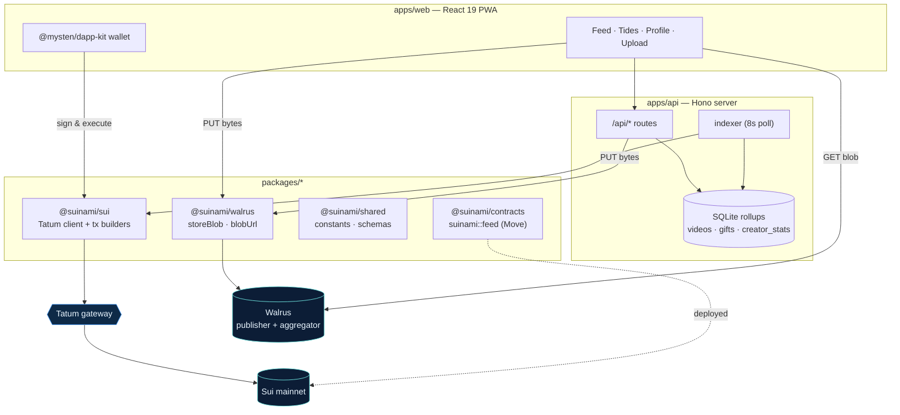

# Architecture overview

Suinami is a small monorepo with a deliberately strict separation of concerns. Three
external systems do the heavy lifting — **Walrus** (bytes), **Sui** (graph), **Tatum**
(gateway) — and the app code is the glue between them.

## Components

## The two write paths and one read path

Suinami has exactly three kinds of data movement. Keeping them separate is what makes the
system easy to reason about.

| Path | Who initiates | Through | Lands in |
|---|---|---|---|
| **Media write** | Browser (or API) | Walrus **publisher** (`PUT /v1/blobs`) | A Walrus blob + a Sui `Blob` object owned by the creator |
| **Graph write** | Wallet-signed tx | **Tatum** → Sui | A Move call in `suinami::feed` (post / like / gift / profile) |
| **Read** | Browser | API (feed/leaderboard/profile) + Walrus **aggregator** (`GET /v1/blobs/:id`) | Rendered feed cards with playable URLs |

The graph write never touches Walrus and the media write never touches Tatum — they meet
only at the `blob_id` string, which the client passes into `post_video`.

## Why an indexer at all?

Reading a vertical feed by scanning chain objects on every request would be slow and
RPC‑heavy. Instead, a boot‑safe **indexer** polls Sui events through Tatum every 8 seconds
and projects them into local SQLite rollups (`videos`, `gift_events`, `creator_stats`).
The `/api/*` routes then serve those rollups in a single fast query. Because the rollups
are derived purely from chain events, they rebuild automatically from scratch — no database
volume is required for deployment. → [The indexer](indexer.md)

## Technology

| Layer | Stack |
|---|---|
| Web | React 19 · Vite 6 · Tailwind v4 · `@mysten/dapp-kit` · TanStack Query · `motion` |
| API | Hono · `@hono/node-server` · better-sqlite3 · drizzle-orm · zod |
| Sui | `@mysten/sui` v2.17 (`SuiJsonRpcClient`) — wired to Tatum in `@suinami/sui` |
| Move | `suinami::feed`, Sui Move 2024 edition |
| Storage | Walrus mainnet (publisher + aggregator) |
| Gateway | Tatum Sui RPC (`x-api-key`) |
| Tooling | pnpm + Turborepo, Node 22.11 |

Continue to the concrete flows: [posting a video](posting.md) and [gifting SUI](gifting.md).
