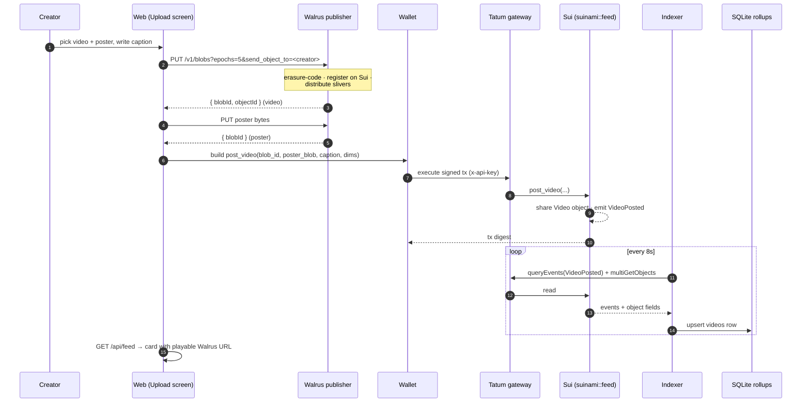

# Posting a video

Posting is the flow that ties all three layers together: bytes go to **Walrus**, a Move
call on **Sui** records the pointer, and the **indexer** (polling through **Tatum**) makes
it appear in the feed.

## Sequence

## Step by step

1. **Upload the media to Walrus.** The client `PUT`s the raw bytes to the Walrus publisher at
   `${publisherUrl}/v1/blobs?epochs=5`. Crucially it appends `&send_object_to=<creatorAddress>`
   so the on‑chain Walrus `Blob` object is transferred to the *creator* — not the publisher.
   The publisher returns the content‑addressed `blobId`. The poster frame is uploaded the same
   way. → [Walrus](../walrus.md)

2. **Record the pointer on Sui.** The wallet signs and executes `post_video(feed, blob_id,
   poster_blob, caption, duration_ms, width, height, clock)`. The Move function shares a new
   `Video` object holding the Walrus pointers and zeroed counters, bumps the singleton `Feed`
   registry, and emits `VideoPosted` (which carries the Walrus pointers inline so the indexer
   never has to re‑read the object just to build a playable card). → [Move functions](../sui/functions.md)

3. **Index it.** Within ~8 seconds the indexer's poll reads `VideoPosted`, hydrates the
   authoritative counts/dimensions from the `Video` object (one `multiGetObjects` call), and
   upserts a row into the `videos` rollup. → [The indexer](indexer.md)

4. **Serve it.** `GET /api/feed` reads the rollup and resolves each `blob_id` to a playable
   aggregator URL (`${aggregatorUrl}/v1/blobs/${blobId}`) — the Walrus↔Sui bridge, resolved for
   the browser. → [API reference](../api.md)

!!! note "Ownership is the point"
    Forgetting `send_object_to` would leave the `Blob` object owned by whoever runs the
    publisher. Suinami sets it on every upload, so creators own their media on‑chain and can
    later extend or delete it.

## The bytes never touch Sui

Only the `blob_id` and `poster_blob` **strings** land on chain. The video itself —
potentially up to 100 MB — lives entirely on Walrus. This keeps on‑chain state tiny while
still giving every video a verifiable, censorship‑resistant home.
