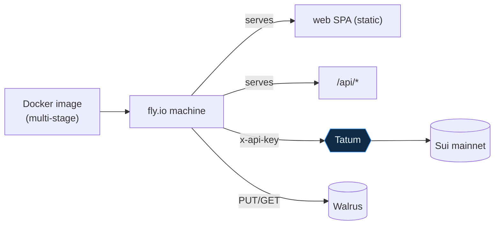
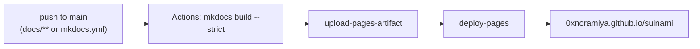

# Deployment

## The app — fly.io single image

Suinami ships as **one container**: the Hono API serves the built web SPA *and* `/api/*`, so a
judge or reviewer gets a single URL. The indexer rebuilds the feed from chain on boot, so **no
database volume is needed** — the feed repopulates within ~8 s of start, and one machine is
kept warm so it's always populated.



| File | Purpose |
|---|---|
| `Dockerfile` | Multi‑stage: install deps → `vite build` the SPA → run the API (which hosts the SPA) |
| `fly.toml` | Public env (network, RPC, Walrus, package ids), `internal_port = 8080`, one warm machine, `/health` check |
| `deploy/fly-deploy.sh` | Reads `.env`, sets the `TATUM_API_KEY` secret, runs `fly deploy` with the `VITE_*` build args |

Secrets are never committed: `fly.toml` holds only public values, `TATUM_API_KEY` is a fly
secret, and the client‑exposed‑by‑design `VITE_*` values are passed as build args at deploy
time.

```bash
# from the repo root, with .env filled in
./deploy/fly-deploy.sh
fly open      # the live URL
fly logs      # you'll see "indexer: starting poll loop"
```

See [`DEPLOY.md`](https://github.com/0xNoramiya/suinami/blob/main/DEPLOY.md) in the repo for the
full one‑time setup.

---

## These docs — GitHub Pages

This site is built with **MkDocs Material** and deployed to GitHub Pages by a GitHub Actions
workflow (`.github/workflows/docs.yml`). Pages source is set to **GitHub Actions** in repo
Settings → Pages.



| File | Purpose |
|---|---|
| `mkdocs.yml` | Site config: nav, theme (Suinami palette), Mermaid via `pymdownx.superfences` |
| `docs/` | The Markdown pages + `stylesheets/extra.css` brand overrides |
| `docs/requirements.txt` | Pinned `mkdocs-material` for reproducible CI builds |
| `.github/workflows/docs.yml` | Build on push to `main`, publish to Pages |

### Build the docs locally

```bash
python3 -m venv .docs-venv
.docs-venv/bin/pip install -r docs/requirements.txt
.docs-venv/bin/mkdocs serve     # live preview at http://127.0.0.1:8000
.docs-venv/bin/mkdocs build --strict   # what CI runs
```

Mermaid diagrams render client‑side: fenced ```` ```mermaid ```` blocks are emitted as
`<div class="mermaid">` and Material loads `mermaid.js` to draw them — no build‑time rendering
step required.
