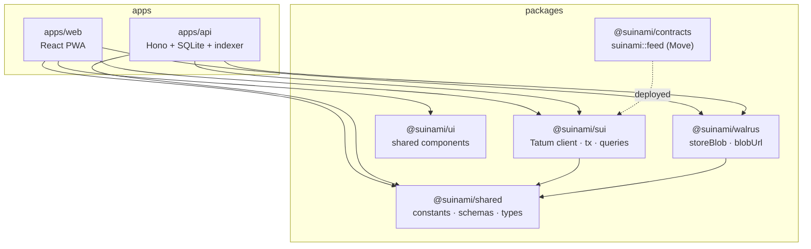

# Project structure

Suinami is a pnpm + Turborepo monorepo. Apps consume packages; packages never depend on apps.
The dependency direction keeps each integration (Walrus, Sui/Tatum) in exactly one place.



## Layout

```text
suinami/
├─ apps/
│  ├─ web/                 # React 19 + Vite 6 PWA (Feed, Tides, Profile, Upload)
│  └─ api/
│     └─ src/
│        ├─ index.ts       # Hono app; serves /api/* and the built SPA
│        ├─ indexer.ts     # 8s event poll → SQLite rollups (boot-safe)
│        ├─ env.ts         # validated env + packageConfigured flag
│        ├─ routes/        # feed · upload · leaderboard · profile · gifts · comments
│        └─ db/            # drizzle schema + better-sqlite3
├─ packages/
│  ├─ contracts/           # Move package: sources/feed.move
│  ├─ sui/                 # THE Tatum integration point (client.ts) + tx/queries
│  ├─ walrus/              # publisher/aggregator client (storeBlob, blobUrl)
│  ├─ shared/              # constants (tiers, RPC urls), zod schemas, types
│  └─ ui/                  # shared React components
├─ deploy/                 # fly.io deploy script
├─ docs/                   # this documentation site (MkDocs Material)
├─ Dockerfile · fly.toml   # single-image deployment
└─ mkdocs.yml
```

## The single-responsibility integration points

Two files are deliberately the *only* place each external system is wired in:

| Concern | The one place | Doc |
|---|---|---|
| **Tatum** — every Sui RPC | `packages/sui/src/client.ts` (`getSuiClient`) | [Tatum](../tatum.md) |
| **Walrus** — every blob read/write | `packages/walrus/src/index.ts` (`storeBlob`, `blobUrl`) | [Walrus](../walrus.md) |
| **Sui model** — the social graph | `packages/contracts/sources/feed.move` | [Object model](../sui/objects.md) |

Constants that must stay in sync across all three (gift tier floors, RPC URLs, Move call
targets, upload limits) live once in `@suinami/shared` and are imported everywhere — so the
on‑chain model, the API, and the UI can't drift apart.
