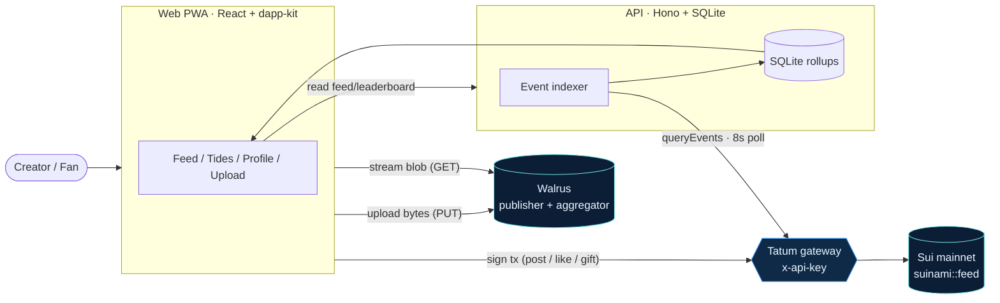

# suinami — developer docs

**Short-form video, fully on-chain social.** A vertical TikTok/Reels-style feed where the
video bytes live on **Walrus** decentralized storage, the social graph — profiles, posts,
likes, and real‑SUI gifting — lives as **Sui Move** objects, and **every** Sui RPC routes
through the **Tatum** gateway. No public fullnode is ever contacted.

> The name is `Sui` (水, water) + `tsunami`.

WALRUS — your media
SUI — your graph
TATUM — every call

---

## The one-paragraph mental model

Three layers, one wave. **Walrus** holds the bytes (videos, posters, avatars) and hands
the on-chain storage object to the *creator*, so users own their media. **Sui** holds the
graph: `Profile`, `Video`, `Like`, and `GiftReceipt` are Move objects anyone can read and
no one can censor. **Tatum** is the single gateway every read, write, and indexer poll
travels through. The only coupling between Walrus and Sui is a content‑addressed
`blob_id` string carried on the Sui objects.

---

## Live deployment

| | |
|---|---|
| Live demo | **[suinami-demo.fly.dev](https://suinami-demo.fly.dev)** |
| Network | `mainnet` |
| Move package | `0xc8cd42bb010547a96436db9680576a3d112fdbc39e5016def3a97b9bbfb77317` |
| Shared `Feed` object | `0x3560a1ee825b2b61adbcbdacec489cfc9e96e18e057ba1ea24cac665b1690885` |
| Sui RPC | `https://sui-mainnet.gateway.tatum.io` (auth via `x-api-key`) |
| Media | Walrus mainnet — content-addressed blobs, streamed from a mainnet aggregator |

It's the real mainnet app: browse the feed, leaderboard, and any creator's profile with no
wallet; connect a Sui wallet (e.g. Sui Wallet or Suiet) to like, gift, or post. Verify it
on‑chain on [SuiVision](https://suivision.xyz), or hit the API directly: `/api/feed`,
`/api/leaderboard`, `/api/profile/<addr>`, `/api/gifts?address=<addr>`.

---

## What makes this notable

- **Walrus is the storage layer, not a CDN stand‑in.** Real publisher writes, erasure‑coded
  slivers across storage nodes, aggregator reads — and an **on‑chain ownership hand‑off** so
  the *creator* owns the Sui `Blob` object for every video, poster, and avatar.
  → [Walrus](walrus.md)
- **A clean, content‑addressed Walrus ↔ Sui bridge.** The only coupling is the
  content‑addressed `blob_id`, carried on the `Video`/`Profile` objects *and* in their events.
  → [Object model](sui/objects.md)
- **A real Tatum gateway gap, solved.** Tatum doesn't proxy `suix_getLatestSuiSystemState`,
  which the Mysten SDK auto‑calls during gas resolution. The fix is an explicit‑gas recipe
  wired through one client so the credential can't be bypassed. → [Tatum](tatum.md)
- **A complete product.** Four screens, a live mainnet deployment, an event indexer,
  optimistic‑but‑real on‑chain writes, a gift leaderboard, and a creator upload→publish loop.

---

## Where to next

- :material-rocket-launch: **[Quickstart](getting-started/quickstart.md)** — run the whole
  stack locally in a few commands.
- :material-sitemap: **[Architecture](architecture/overview.md)** — how the web app, API,
  indexer, Walrus, Sui, and Tatum fit together.
- :material-database: **[Object model](sui/objects.md)** — the Move structs, events, and the
  Walrus↔Sui bridge.
- :material-api: **[API reference](api.md)** — every endpoint the web client calls.

