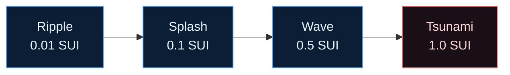

# Gift tiers

Gifting sends **real SUI** from a fan to a creator. The four tiers are defined once in
`@suinami/shared` (`GIFT_TIERS`) and their MIST floors are asserted on chain in `send_gift`.
Above the floor, the tier is cosmetic — it drives the splash → tsunami water animation on the
client, and a fan may always send more than the floor.

> `1 SUI = 1_000_000_000 MIST` (`MIST_PER_SUI`).

| Tier | `id` | Floor (SUI) | Floor (MIST) | Vibe |
|---|---|---|---|---|
| **Ripple** | `0` | 0.01 | `10_000_000` | A gentle nod. |
| **Splash** | `1` | 0.1 | `100_000_000` | Make a splash. |
| **Wave** | `2` | 0.5 | `500_000_000` | Ride the wave. |
| **Tsunami** | `3` | 1.0 | `1_000_000_000` | Unleash a tsunami. |



## On-chain enforcement

The Move floors mirror `GIFT_TIERS` exactly and are the source of truth:

```move
const TIER0_RIPPLE_MIST: u64  = 10_000_000;     // 0.01 SUI
const TIER1_SPLASH_MIST: u64  = 100_000_000;    // 0.1  SUI
const TIER2_WAVE_MIST: u64    = 500_000_000;    // 0.5  SUI
const TIER3_TSUNAMI_MIST: u64 = 1_000_000_000;  // 1.0  SUI
```

`send_gift` calls `tier_floor_mist(tier)` (which aborts `EBadTier` for any `tier > 3`) and then
asserts `payment >= floor`, aborting `EInsufficientGift` if the coin is short. → [`send_gift`](functions.md#send_gift)

## Helpers

`@suinami/shared` exposes conversions used across the API and UI so amounts are formatted
consistently:

```ts
mistToSui("500000000"); // => 0.5
suiToMist(0.5);         // => 500000000n
tierById(2);            // => { key: "wave", name: "Wave", floorSui: 0.5, ... }
```
