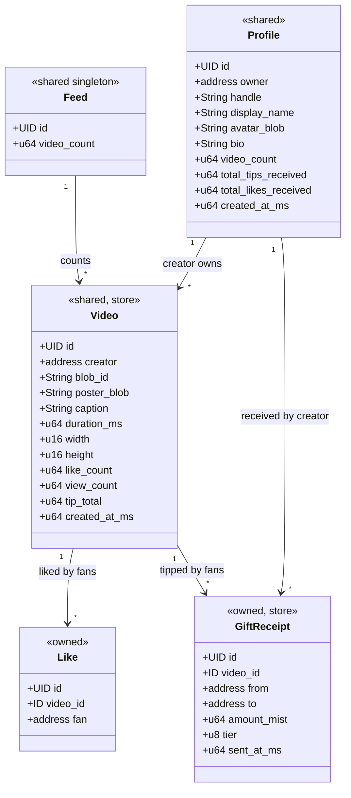

# Object model

The social graph is a set of Sui Move objects in the `suinami::feed` module
(`packages/contracts/sources/feed.move`). Videos themselves are **not** stored on chain — only
their Walrus pointers. Everything here is readable by anyone and mutable only through the
module's entry functions.

## The objects at a glance

## Ownership & sharing model

| Object | Abilities | Shared / owned | Why |
|---|---|---|---|
| `Feed` | `key` | **Shared** singleton (made in `init`) | Cheap global video counter / discovery anchor; any account posts into it concurrently |
| `Profile` | `key` | **Shared** | So anyone can read it and tip the creator by referencing it in `send_gift` |
| `Video` | `key, store` | **Shared** | So any fan can like / view / gift it; `store` lets it live in collections |
| `Like` | `key` | **Owned** by the fan | Proof‑of‑like; burning it (unlike) decrements the counter |
| `GiftReceipt` | `key, store` | **Owned** by the tipper | A wallet‑displayable receipt of a tip |

!!! note "The Walrus pointers"
    `Video.blob_id` / `Video.poster_blob` and `Profile.avatar_blob` are the **only** link to
    the media on Walrus. They are content‑addressed ids resolved via
    `${aggregatorUrl}/v1/blobs/${blob_id}`. → [Walrus](../walrus.md)

## Events

Every state change emits a `copy, drop` event. The indexer subscribes to these to build the
read model — and `VideoPosted` carries the Walrus pointers inline so a playable feed card can
be built without re‑reading the object.

| Event | Emitted by | Key fields |
|---|---|---|
| `ProfileCreated` | `create_profile` | `profile_id`, `owner`, `handle` |
| `VideoPosted` | `post_video` | `video_id`, `creator`, `blob_id`, `poster_blob`, `caption`, `created_at_ms` |
| `VideoLiked` | `like_video` | `video_id`, `fan`, `new_count` |
| `VideoUnliked` | `unlike_video` | `video_id`, `fan`, `new_count` |
| `VideoViewed` | `record_view` | `video_id`, `new_count` |
| `GiftSent` | `send_gift` | `video_id`, `from`, `to`, `amount_mist`, `tier`, `video_tip_total`, `creator_tip_total`, `sent_at_ms` |

## Abort codes

| Code | Constant | Meaning |
|---|---|---|
| `0` | `EInsufficientGift` | Gift payment below the selected tier's floor |
| `1` | `EBadTier` | `tier` argument not in `0..=3` |
| `2` | `ENotProfileOwner` | Caller is not the owner of the `Profile` being mutated |
| `3` | `EProfileVideoMismatch` | `creator_profile` doesn't belong to the video's creator |
| `4` | `ELikeVideoMismatch` | The `Like` being burned doesn't reference this `Video` |

Continue to the [Move functions](functions.md) for the full entry‑function signatures.
