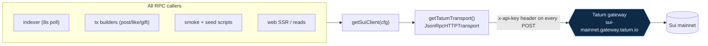
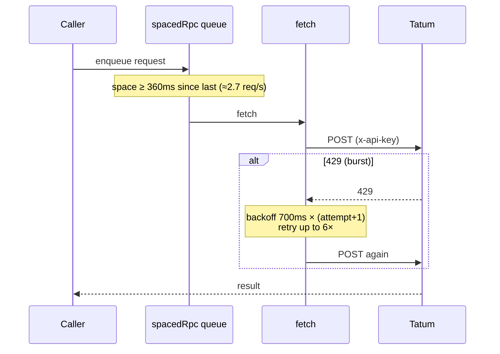

# Tatum — the gateway

**Every** Sui JSON‑RPC call in Suinami — reads, writes, and the indexer's event polling —
flows through the **Tatum** gateway. A public fullnode is never contacted. This is enforced
structurally: there is exactly one place the transport is built, in
`packages/sui/src/client.ts`.

## The single integration point



The Tatum credential is wired in exactly once, via the transport's `rpc.headers` option, so it
rides along with every outbound JSON‑RPC POST (`queryEvents`, `getOwnedObjects`,
`getReferenceGasPrice`, `dryRun`, `execute`, …). There is no per‑call plumbing to forget:

```ts
new JsonRpcHTTPTransport({
  url,                  // TATUM_RPC_URLS[network] (or an explicit override)
  fetch: tatumFetch,    // throttled + 429-retrying (see below)
  rpc: {
    headers: { "x-api-key": cfg.apiKey },   // <-- authenticates EVERY Sui RPC POST
  },
});
```

Clients are memoized per config (`getSuiClient`), so the indexer and API reuse one client and
its connection. Construction is lazy and offline — safe to call at module scope.

## The gateways

| Network | Tatum Sui RPC URL |
|---|---|
| `mainnet` | `https://sui-mainnet.gateway.tatum.io` |
| `testnet` | `https://sui-testnet.gateway.tatum.io` |
| `devnet` | `https://sui-devnet.gateway.tatum.io` |

`resolveRpcUrl(cfg)` returns `cfg.rpcUrl` if set (e.g. a local fullnode in tests), otherwise
the Tatum gateway for the network.

## Rate-limit handling

Tatum's gateway caps at ~3 requests/second and returns `429` on bursts (the Mysten SDK makes
~2 calls per executed tx, and the indexer polls). Suinami funnels **every** Sui RPC through one
throttled, `429`‑retrying fetch so no caller has to think about it:



- `MIN_RPC_INTERVAL_MS = 360` → ~2.7 req/s, comfortably under the 3/s cap.
- A shared serial queue (`spacedRpc`) guarantees the spacing across all callers.
- `429` responses retry with a linear‑ramp backoff, up to `MAX_RPC_RETRIES = 6`.

## The gateway gap we solved

!!! warning "Tatum doesn't proxy `suix_getLatestSuiSystemState`"
    The Mysten SDK auto‑calls `suix_getLatestSuiSystemState` during its default **gas
    resolution** when building a transaction. Tatum's gateway doesn't proxy that method, so the
    naive write path silently breaks.

The fix is to resolve gas **explicitly** instead of relying on the SDK's default path —
fetching the reference gas price via a method Tatum *does* support
(`getReferenceGasPrice`, exposed as `getReferenceGasPrice(client)`), and supplying gas data on
the transaction directly. Because this is wired through the single `@suinami/sui` client, the
Tatum credential can never be bypassed and the gas recipe is network‑agnostic.

## Verifying it for real

`pnpm smoke` performs a Sui read through the Tatum gateway and confirms the `x-api-key` header
path works end‑to‑end. The `pnpm smoke:walrus` test additionally reads a Walrus `Blob` object's
owner **through Tatum** to prove the ownership hand‑off. → [Walrus](walrus.md)
