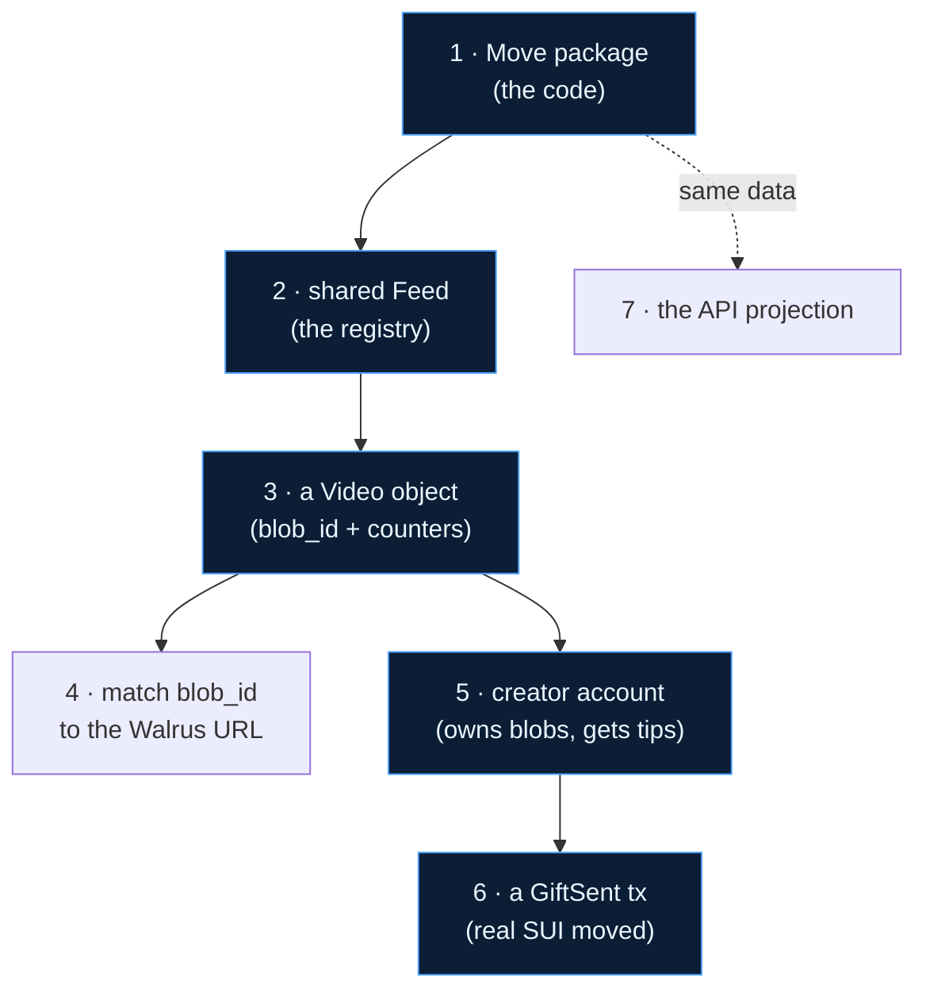

# Verify on-chain

Suinami's claims are independently verifiable. Nothing here asks you to trust the app — every
object and transaction is on **Sui mainnet** and every blob is on **Walrus mainnet**. This page
walks you through checking each one yourself, with real links.

!!! tip "Everything you need is public"
    The Move package is immutable, the `Feed`/`Profile`/`Video` objects are shared (anyone can
    read them), and the gift transactions are on chain. You only need a block explorer
    ([SuiVision](https://suivision.xyz)) and `curl`.

## The verification path



## 1. The Move package

The published, **immutable** `suinami::feed` package — the exact code documented in
[Move functions](sui/functions.md) and [Object model](sui/objects.md).

→ **[View package `0xc8cd42…b77317` on SuiVision](https://suivision.xyz/package/0xc8cd42bb010547a96436db9680576a3d112fdbc39e5016def3a97b9bbfb77317)**

Open the **Modules** tab to read the on‑chain `feed` module source, or **Code** to see the
disassembled bytecode. There is no admin key and no upgrade cap — it can't be changed.

## 2. The shared Feed registry

The singleton `Feed` object created in `init`. Its `video_count` field is the global counter
bumped by every `post_video`.

→ **[View Feed object `0x3560a1…690885`](https://suivision.xyz/object/0x3560a1ee825b2b61adbcbdacec489cfc9e96e18e057ba1ea24cac665b1690885)**

Note it's a **Shared** object — that's what lets any account post into it concurrently.

## 3. A Video object

A real posted video. Open it and look at its fields: `creator`, `blob_id`, `poster_blob`,
`caption`, and the live `like_count` / `view_count` / `tip_total`.

→ **[View Video object `0xc97162…2f5f77`](https://suivision.xyz/object/0xc97162af83325ce6b686f0f5d0cf7ba9dbbb08b12a4dabbcbc2b4f5a732f5f77)**

## 4. Match the `blob_id` to Walrus — the bridge, proven

This is the single most important thing to verify: the **only** link between the on‑chain object
and the media bytes is the content‑addressed `blob_id`. From the Video object above, read its
`blob_id` field:

```
blob_id = D4MUrpxGYDgiVzGjUZaLQiO_DsKUkdGzcLp0NR1odFk
```

Now resolve that exact id against any Walrus mainnet aggregator and you get the playable bytes:

```bash
curl -I https://aggregator.walrus.atalma.io/v1/blobs/D4MUrpxGYDgiVzGjUZaLQiO_DsKUkdGzcLp0NR1odFk
# → 200/206, an MP4 (ftyp/avc1)
```

The id on chain **is** the content hash of the bytes on Walrus — no database, no signed URL, no
second source of truth. → [The Walrus↔Sui bridge](walrus.md#the-walrus-sui-bridge)

## 5. The creator account

The creator's address owns the Walrus `Blob` objects for their media (via the
`send_object_to` hand‑off) and is the recipient of gifts.

→ **[View creator `0xb086cd…81847a`](https://suivision.xyz/account/0xb086cdf98fcdbe3cc6d8ba967c4f7aaac045c039307f44c78b32988a6881847a)**

On the **Objects** tab you'll find this account owns Walrus `Blob` objects — proof that media
ownership was handed to the creator, not left with the publisher.

## 6. A gift transaction — real SUI moved

A real `send_gift` call. Open the transaction and inspect the **Balance Changes**: SUI leaves the
fan and arrives at the creator; a `GiftReceipt` is minted to the fan; a `GiftSent` event is
emitted.

→ **[View GiftSent tx `5aXupwjg…JkuPz`](https://suivision.xyz/txblock/5aXupwjg1D9y8X1EfrzRECHsLg9JFfTqSXWxjC7JkuPz)**

This one is a **Ripple** tier (`tier 0`) gift of **0.01 SUI** (`10_000_000` MIST) — matching the
floor enforced on chain by `send_gift`. → [Gift tiers](sui/gifts.md)

## 7. The same data, via the API

Everything above is what the app's read API projects (through the [indexer](architecture/indexer.md),
every RPC via [Tatum](tatum.md)). Cross‑check it yourself:

```bash
# the feed — real Video object ids + resolved Walrus URLs
curl -s https://suinami-demo.fly.dev/api/feed | jq '.cards[0]'

# the creator's received gift ledger — each entry carries the tx digest
curl -s 'https://suinami-demo.fly.dev/api/gifts?address=0xb086cdf98fcdbe3cc6d8ba967c4f7aaac045c039307f44c78b32988a6881847a&dir=received' | jq

# the leaderboard — ranks backed by on-chain activity (each row has a verifyUrl)
curl -s https://suinami-demo.fly.dev/api/leaderboard | jq '.rows[0]'
```

The `videoId`s returned by `/api/feed` are the very object ids you opened on SuiVision; the
`digest` in each gift entry is the very transaction you inspected. The API is a convenience — the
chain is the source of truth.

!!! note "Run the proofs locally"
    Two smoke tests assert the integrations against live infrastructure:
    `pnpm smoke` (a Sui read returns through Tatum with the `x-api-key` header) and
    `pnpm smoke:walrus` (bytes store→read byte‑for‑byte; the `Blob` object's owner, read back
    *through Tatum*, equals the creator). → [Quickstart](getting-started/quickstart.md#4-verify-the-integrations)
