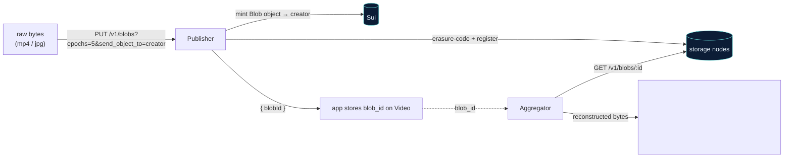
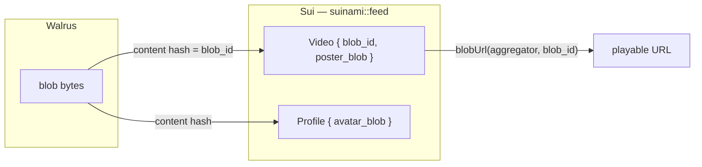

# Walrus — the storage layer

Walrus is where the actual bytes live: every video, poster frame, and avatar. It is **not a
CDN stand‑in** — Suinami uses real publisher writes (erasure‑coded slivers distributed across
storage nodes), aggregator reads, and an on‑chain ownership hand‑off. The client lives in
`packages/walrus/src/index.ts`.

## Two services

Walrus splits responsibilities across two independent HTTP endpoints, so every function in
`@suinami/walrus` takes its base URL explicitly:

| Service | Side | What it does | Suinami calls |
|---|---|---|---|
| **Publisher** | write | `PUT` raw bytes → erasure‑codes, registers the blob on Sui, distributes slivers, returns the content‑addressed `blobId` | `storeBlob()` |
| **Aggregator** | read | `GET /v1/blobs/:id` → reconstructs the original bytes from storage nodes | `getBlob()` / `blobUrl()` |



## storeBlob — the write path

```ts
const { blobId, objectId, alreadyCertified } = await storeBlob(bytes, {
  publisherUrl: env.WALRUS_PUBLISHER_URL,
  epochs: 5,                       // storage lifetime; defaults to WALRUS_DEFAULT_EPOCHS
  sendObjectTo: creatorAddress,    // <-- the make-or-break flag (see below)
});
```

The request URL is `${publisherUrl}/v1/blobs?epochs=${epochs}`, with
`&send_object_to=<address>` appended when `sendObjectTo` is set. The helper normalizes the two
shapes Walrus can return:

- **`newlyCreated`** — a brand‑new blob was stored and certified on Sui. Returns
  `{ blobId, objectId, endEpoch, alreadyCertified: false }`.
- **`alreadyCertified`** — Walrus already had a certified copy of these exact bytes (content
  addressing means identical bytes ⇒ identical id). Returns `{ blobId, alreadyCertified: true }`.

!!! danger "The #1 Walrus integration mistake: ownership"
    By default the **publisher's own** Sui account becomes the owner of the on‑chain Walrus
    `Blob` object minted during a `PUT`. That means your users' media would belong to whoever
    runs the publisher. Appending `send_object_to=<creatorAddress>` transfers that `Blob`
    object to the **creator**, so the user — not the infrastructure — owns (and can later
    extend or delete) their own video, poster, and avatar blobs. Suinami sets this on every
    upload.

## Reading a blob

```ts
const url = blobUrl(aggregatorUrl, blobId);     // `${aggregatorUrl}/v1/blobs/${blobId}`
const bytes = await getBlob(aggregatorUrl, blobId);
```

A `404` from the aggregator means the blob's storage epochs expired (or it never certified) —
the data is gone from the network. `getBlob` surfaces this as a friendly **"blob washed
away"** error. Because blobs are content‑addressed, **any** mainnet aggregator serves a given
`blobId` identically, so the read endpoint can be swapped freely.

## The Walrus ↔ Sui bridge

This is the single most important integration detail in Suinami:

> The **entire** link between Walrus storage and the Sui object graph is the content‑addressed
> `blob_id` (and `poster_blob`, `avatar_blob`) **string** carried on the Sui Move objects.



There is no database join, no signed URL, no second source of truth — just one content hash,
recorded on chain and resolved back to an aggregator URL by the API. → [Object model](sui/objects.md)

## Verifying it for real

`pnpm smoke:walrus` proves the round‑trip against live infrastructure: it stores bytes,
reads them back **byte‑for‑byte**, and reads the minted `Blob` object's owner *through Tatum*
to confirm `send_object_to` actually moved the object to the creator on chain.
